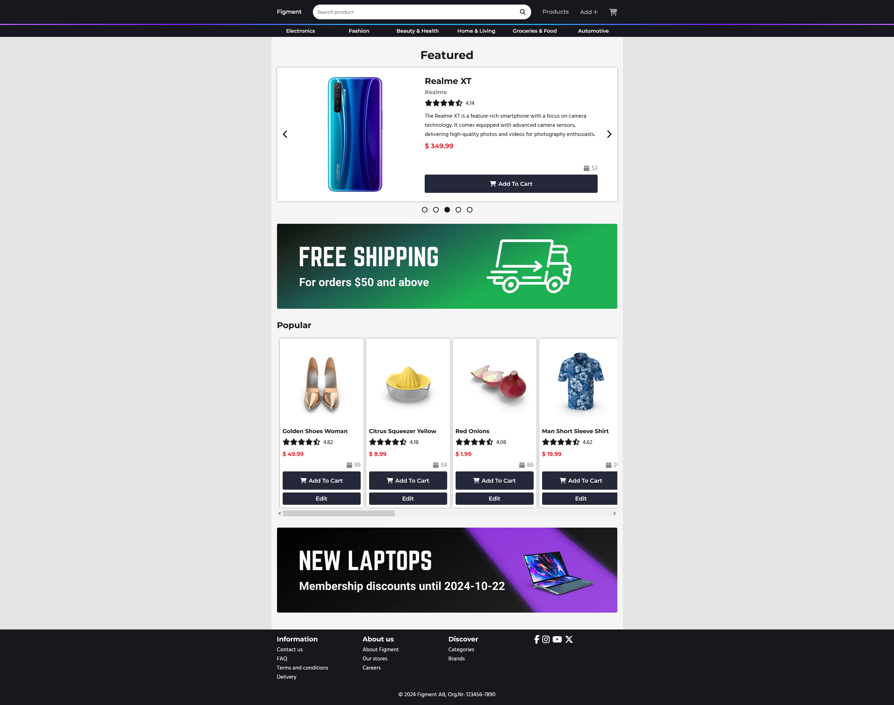

# Product Portal
Examining individual project built with React, ReactRouter, TypeScript.

Check out the page [here](https://j-mattias.github.io/product-portal/).

**Features**
- Landing page with a product carousel, product slider and banners.
- Product details page. Click a product to get more details about it.
- Search functionality in the header.
- A shopping cart. Increase/decrease the amount of a certain item, remove an item, clear all items.
- View a list of all products, accessed through the Products route in the header.
- CRUD functionality (with useContext).
  - Add a new product with the add form (with some basic input validation), accessed through the Add route in the header.
  - Edit a product with the edit form (with some basic input validation), accessed through the Edit button on product cards. Here you can also choose to delete a product.
  - A message is displayed when adding, editing, deleting and validating a product.
- Navigate to different categories with the category dropdown menu.
- Pagination where there are more than 24 results. (The URL is updated to reflect query string and current page)
- Responsive.

## Figma
https://www.figma.com/design/ls4KNmdjQu8yZCflpGHo9T/Figment?node-id=0-1&node-type=canvas&t=yS0y0cg33FpRsYtj-0

## API
https://dummyjson.com/docs/products

Some thumbnails from the API have black bars.